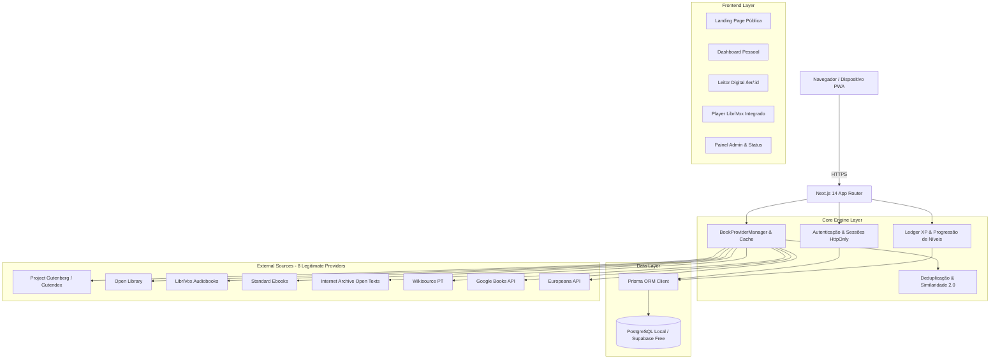

# Arquitetura do Sistema • Entre Páginas 2.0

O **Entre Páginas** é uma plataforma online multiusuário de descoberta literária, organização pessoal e gamificação de leitura, construída sobre Next.js 14 (App Router), Prisma ORM, PostgreSQL (compatível com Supabase) e TypeScript.

---

## 1. Visão Geral da Arquitetura

---

## 2. Componentes Estruturais

### A. Autenticação & Sessões Multiusuário (`src/lib/auth.ts`)
- **Hash de Senha:** `bcryptjs` com salt rounds = 10. Senhas em texto puro **nunca** são persistidas.
- **Tokens de Sessão:** Tokens criptográficos opacos de 256 bits gerados via `crypto.randomBytes(32).toString('hex')`.
- **Cookies de Sessão:** Gravados com atributos `HttpOnly`, `SameSite=Lax`, e `Secure` em ambientes de produção.
- **Isolamento de Dados:** Cada consulta de estante (`LibraryItem`), meta de leitura (`ReadingGoal`), progresso (`ReadingProgress`) e sessão de áudio (`ListeningProgress`) é rigidamente vinculada a `userId = currentUser.id`.

### B. Motor de Provedores & Agregação Resiliente (`src/lib/providers/`)
- **Interface Base:** `BookProvider` define o contrato unificado: `searchBooks()`, `getBook()`, `getDownloadOptions()`, `getCover()`, e `checkHealth()`.
- **Tolerância a Falhas (`Promise.allSettled`):** Se qualquer provedor de terceiros falhar, cair ou sofrer timeout, o agregador preserva todos os resultados obtidos das demais fontes e registra o incidente em `ProviderLog`.
- **Cache de Dois Níveis:**
  1. *Cache em Memória (LRU/TTL):* Respostas de busca armazenadas por 30 minutos em memória para resposta instantânea.
  2. *Cache de Catálogo Canônico:* Obras salvas no banco de dados local para enriquecimento contínuo.
- **Configuração Declarativa (`provider.config.ts`):** Centraliza rate limits, timeouts, chaves opcionais e termos de licença de cada provedor.

### C. Algoritmo de Deduplicação 2.0 (`src/lib/utils/deduplication.ts`)
Quando o usuário pesquisa um clássico (ex: *"Dom Casmurro"*), o sistema consulta os provedores em paralelo e consolida múltiplos registros em uma única obra canônica:
1. **Correspondência Exata por ISBN:** ISBN-10 e ISBN-13 higienizados e comparados (score = 1.0).
2. **Similaridade de Strings (Coeficiente de Sørensen-Dice):**
   - Normalização textual (remoção de acentos, pontuação e espaços redundantes).
   - Cálculo do índice de sobreposição de bigramas entre títulos e autores.
   - Ponderação: 70% peso do título + 30% peso do autor principal.
   - Limiar de fusão: Score $\ge 0.82$.
3. **Fusão de Metadados:**
   - Preserva o título mais completo e a melhor sinopse.
   - Adota a capa em maior resolução (ex: Open Library).
   - Mescla todas as opções legítimas de download (EPUB, PDF, HTML, TXT, MOBI).
   - Acopla metadados e faixas de audiolivro (LibriVox).
   - Registra a matriz de proveniência de todas as fontes agregadas.

### D. Gamificação & Contabilidade de XP (`src/lib/gamification/`)
- **Idempotência Rigorosa:** O XP de leitura baseia-se em palavras efetivamente lidas ($1\text{ palavra} = 1\text{ XP}$). Reler um trecho não gera pontuação duplicada; o sistema mantém `maxHistoricalPercent` por leitor.
- **Audiolivros:** Implementa `listeningXP` na taxa de $10\text{ XP}$ por minuto de áudio consumido.
- **Livro-Razão (`XPTransaction`):** Todas as movimentações de XP são registradas com tipo (`READING_PROGRESS`, `LISTENING`, `BOOK_COMPLETED`, `ACHIEVEMENT`) para transparência e auditoria.
- **Progressão Não-Linear:** Níveis calculados matematicamente com metas crescentes e insígnias temáticas.

---

## 3. Isolamento e Governança de Dados

1. **Privacidade por Padrão:**
   - A estante pessoal de um usuário não é visível publicamente a menos que o usuário declare expressamente seu perfil como público.
   - Participação no ranking da comunidade é um opt-in voluntário (`participateInRanking = true`).
2. **Sanitização de APIs:**
   - Endpoints públicos como `/api/ranking` e `/api/users/[username]` jamais retornam e-mail, hash de senha, role administrativo ou notas de leitura particulares.
